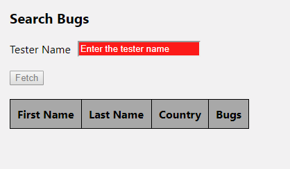

# TechSee Home Assignment

TechSee home assignment using Typescript + React + less + MobX

Initial run:

* Install Node.js
* `npm install`
* `npm start` In one command line
* Open your browser at http://localhost:3000/
* Enjoy!

Screenshots:

  
  

