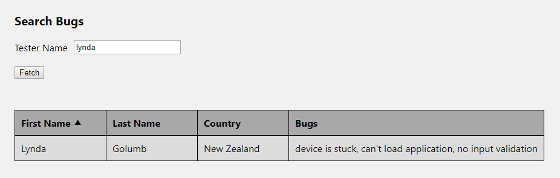

# TechSee Home Assignment

TechSee home assignment using Typescript + React + less + MobX

Initial run:

* Install Node.js
* `npm install`
* `npm start`
* Run chrome using command line: "chrome.exe --user-data-dir="C:/Chrome dev session" --disable-web-security" (disable the Same-origin policy)
* Browse to http://localhost:3000/
* Delete "C:/Chrome dev session" when done
* Enjoy!

Screenshots:

  

